## About
**Rocking** aims at systematically evaluating the robustness of mainstream depth estimation models to various camera configurations. It consists of three parts: camera parameter modeling, $k$-way testing cases generation, and evaluation in CARLA. Based on this, a dedicated dataset, named **CarlaDepth**, is constructed, enabling autonomous driving practitioners to comprehensively evaluate the impact of up to **16 camera parameters** on their models. Furthermore, by using **Rocking**, some interesting findings are uncovered, which been never been discussed in previous studies. 

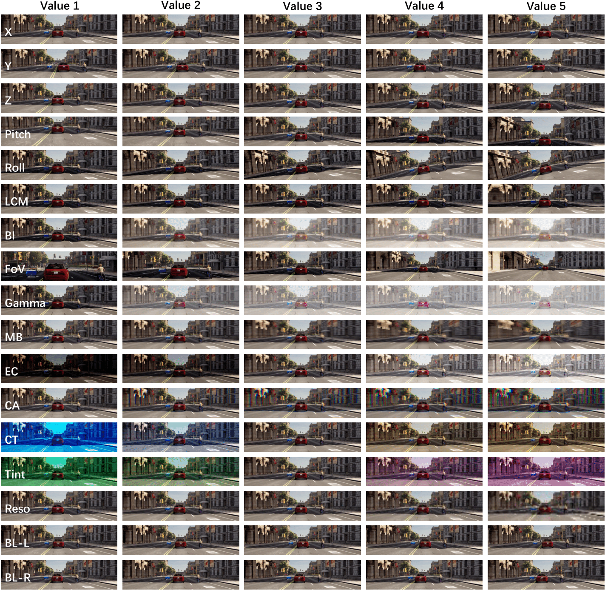

## Updates
- \[2025.03\] - The CarlaDepth dataset is ready to be downloaded. See [Dataset](#dataset) for more details. 
- \[2025.02\] - The code is ready to be accessible. 

## Outline
- [Installation](#installation)
- [Dataset](#dataset)
- [Model Zoo](#model-zoo)
- [Getting Started](#getting-started)
- [Evaluation Results](#evaluation-results)

### Installation
### CARLA 
We use the CARLA simulation platform, which can be [downloaded](https://carla.org).

## Dataset
**CarlaDepth** can be [downloaded](https://entuedu-my.sharepoint.com/:f:/g/personal/tian0140_e_ntu_edu_sg/EvIakljuN2xOvTseh056n5cBedFqkO5ISUXrLW9iuBDqqw?e=Qwa3rU).

its orgnization: 
```
├── MDE
|   ├── k_1
|   │   ├── test_case_0
|   │   │   ├── case_0.json               # Parameter log (see specific details in ./util/data.py)
|   │   │   ├── rgb_cutted                # RGB input images
|   │   │   └── depth_cutted              # Ground truth depth images
|   |   ├──...
|   ├── ...  

├── BDE
|   ├── k_1
|   │   ├── test_case_0
|   │   │   ├── case_0.json               # Parameter log (see specific details in ./util/data.py)
|   │   │   ├── rgb_0.1                   # RGB input images
|   │   │   ├── rgb_0.2
|   │   │   ├── rgb_0.3
|   │   │   ├── rgb_0.4
|   │   │   ├── rgb_0.5
|   │   │   └── depth_0.1                 # Ground truth depth images
|   │   │   └── depth_0.2
|   │   │   └── depth_0.3
|   │   │   └── depth_0.4
|   │   │   └── depth_0.5
|   |   ├──...
|   ├── ...  
```
## Model Zoo
<details open>
<summary>&nbsp<b>Monocular Depth Estimation</b></summary>

> - [x] **[MonoDepth2](https://arxiv.org/abs/1806.01260), ICCV 2019.** <sup>[**`[Code]`**](https://github.com/nianticlabs/monodepth2)</sup>
> - [x] **[ManyDepth](https://arxiv.org/abs/2104.14540), CVPR 2021.** <sup>[**`[Code]`**](https://github.com/nianticlabs/manydepth)</sup>
> - [x] **[Depth Anything V2](https://arxiv.org/abs/2406.09414), NeurIPS 2024.** <sup>[**`[Code]`**](https://github.com/DepthAnything/Depth-Anything-V2/tree/main/metric_depth)</sup>
</details>

<details open>
<summary>&nbsp<b>Binocular Depth Estimation</b></summary>

> - [x] **[PSMNet](https://arxiv.org/abs/1803.08669), CVPR 2018.** <sup>[**`[Code]`**](https://github.com/JiaRenChang/PSMNet)</sup>
> - [x] **[Unimatch](https://arxiv.org/abs/2211.05783), TPAMI 2023.** <sup>[**`[Code]`**](https://github.com/autonomousvision/unimatch)</sup>
> - [x] **[OpenStereo](https://arxiv.org/abs/2312.00343), ICRA 2025.** <sup>[**`[Code]`**](https://github.com/XiandaGuo/OpenStereo)</sup>
</details>


## Getting Started
You can run carla for data collection for MDE models with:

```shell
python mono_carla.py
```
or, if you are using a BDE model,

```shell
python stereo_carla.py
```

Use MDE or BDE models to predict depth, with MonoDepth2 as an example:

```shell
python test_simple.py --image_path assets/test_image.jpg --model_name mono+stereo_640x192 --pred_metric_depth
```

After obtaining the predicted depth, you can evaluate it against the ground truth using various metrics. You can evaluate with 8 different metrics:

```shell
python evaluate_depth.py --pre your_predicted_depth.npy --gt ground_depth.npy --camera MDE
```

or, if you are using a stereo-trained model, you can evaluate it as follows:

```shell
python evaluate_depth.py --pre your_predicted_depth.npy --gt ground_depth.npy --camera BDE --fov 90 --offset 0.5 
```


## Evaluation Results

### Single-Parameter Evaluation
* single-parameter visulation
  
  
* AbsRel
  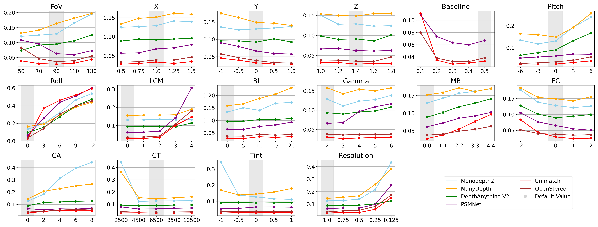

* SqRel
 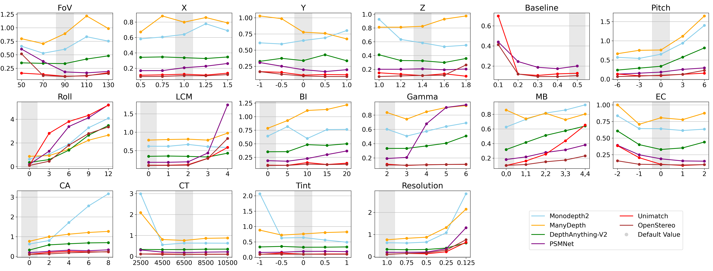

* RMSE
 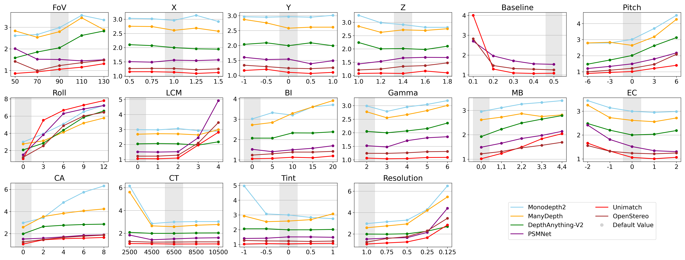

* RMSELog
 

* Delta1
 

* Delta2
 

* Delta3
 

* SILog
 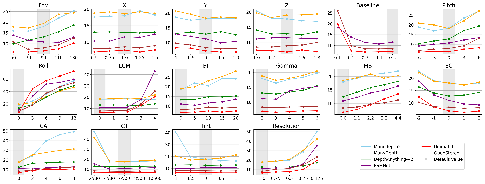


### Dual-Parameter Evaluation(Example: MonoDepth2; for other cases, see ./k_2_summary_final)
* Absrel
  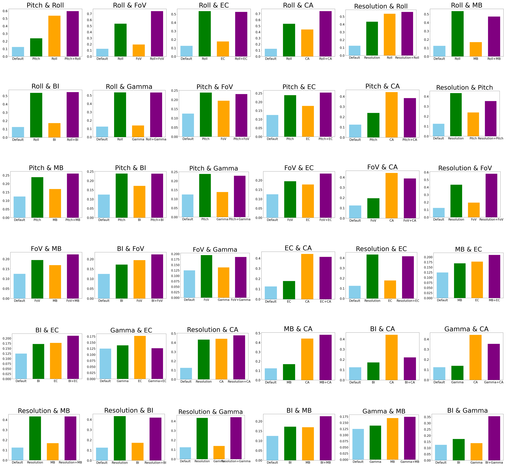

* SqRel
 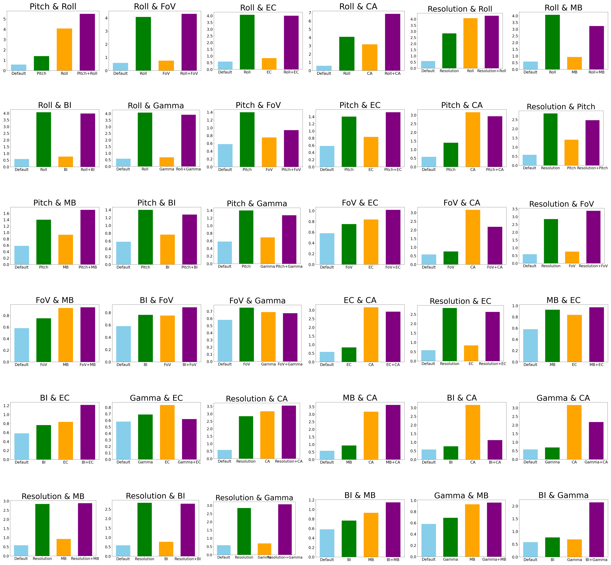

* RMSE
 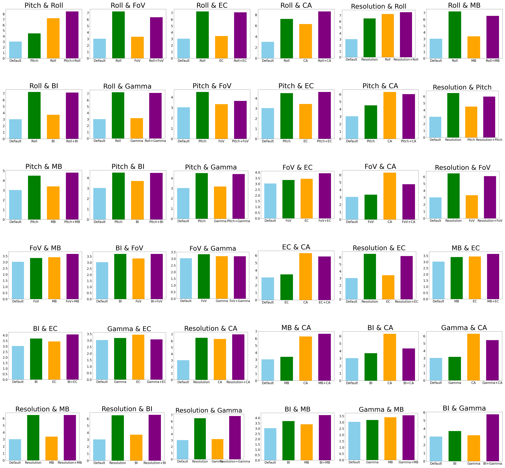

* RMSE Log
 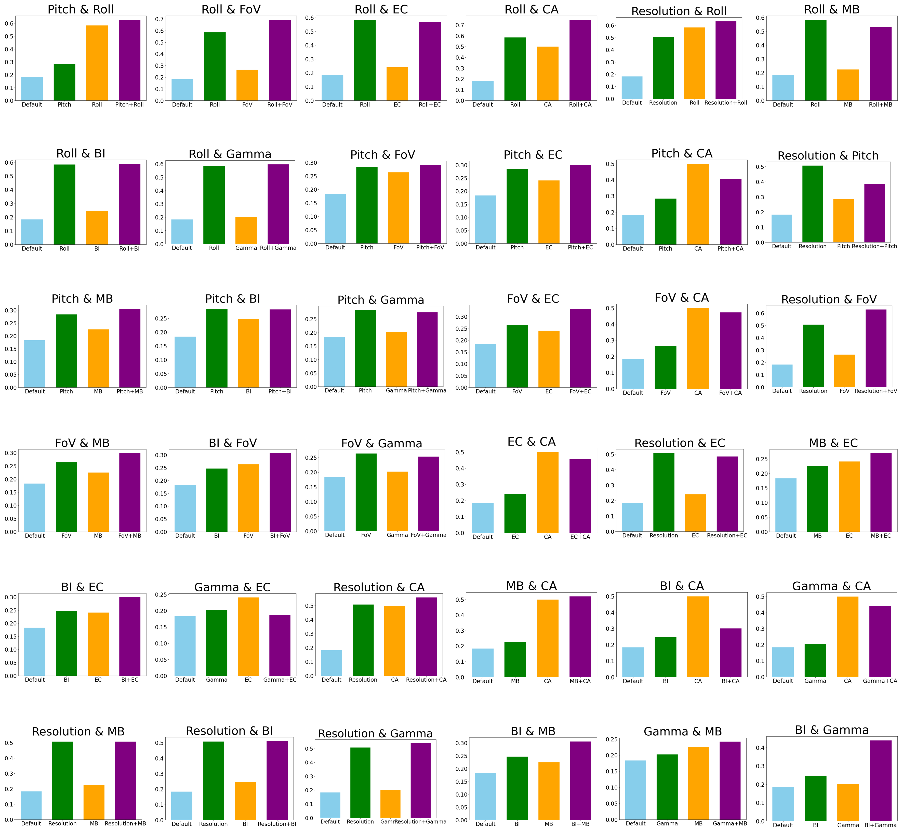

* Delta 1
 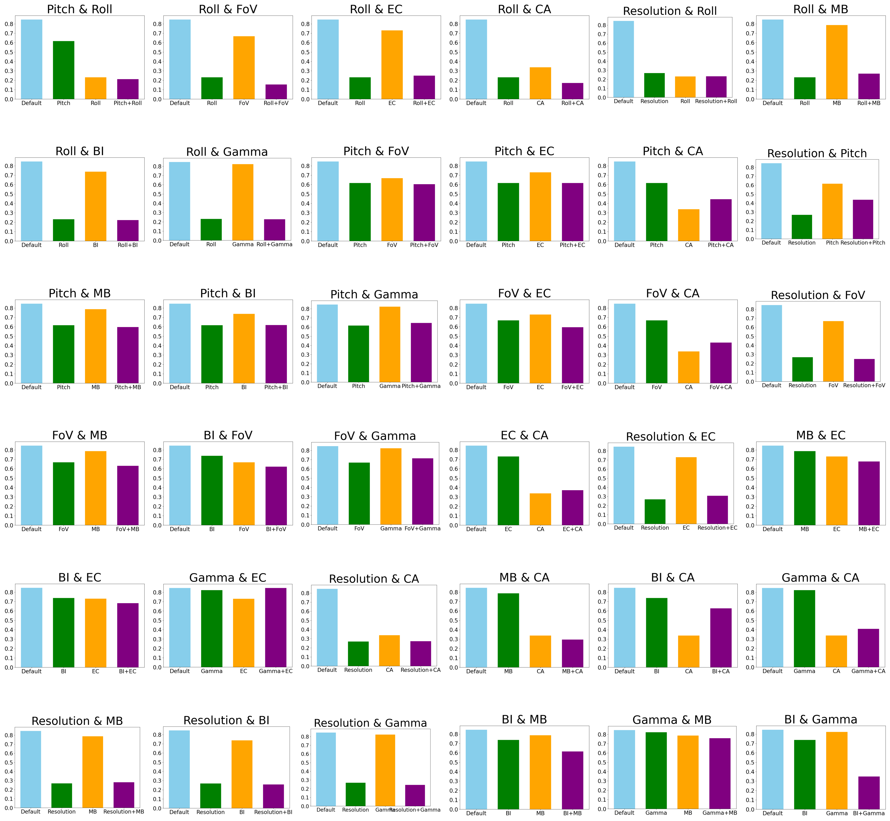

* Delta 2
 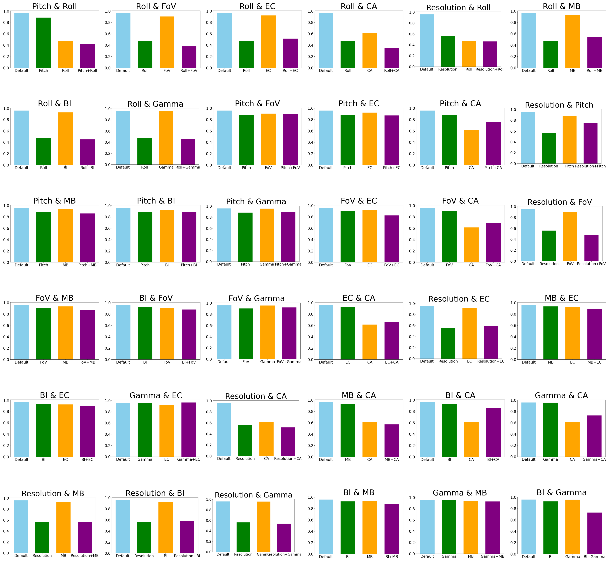

* Delta 3
 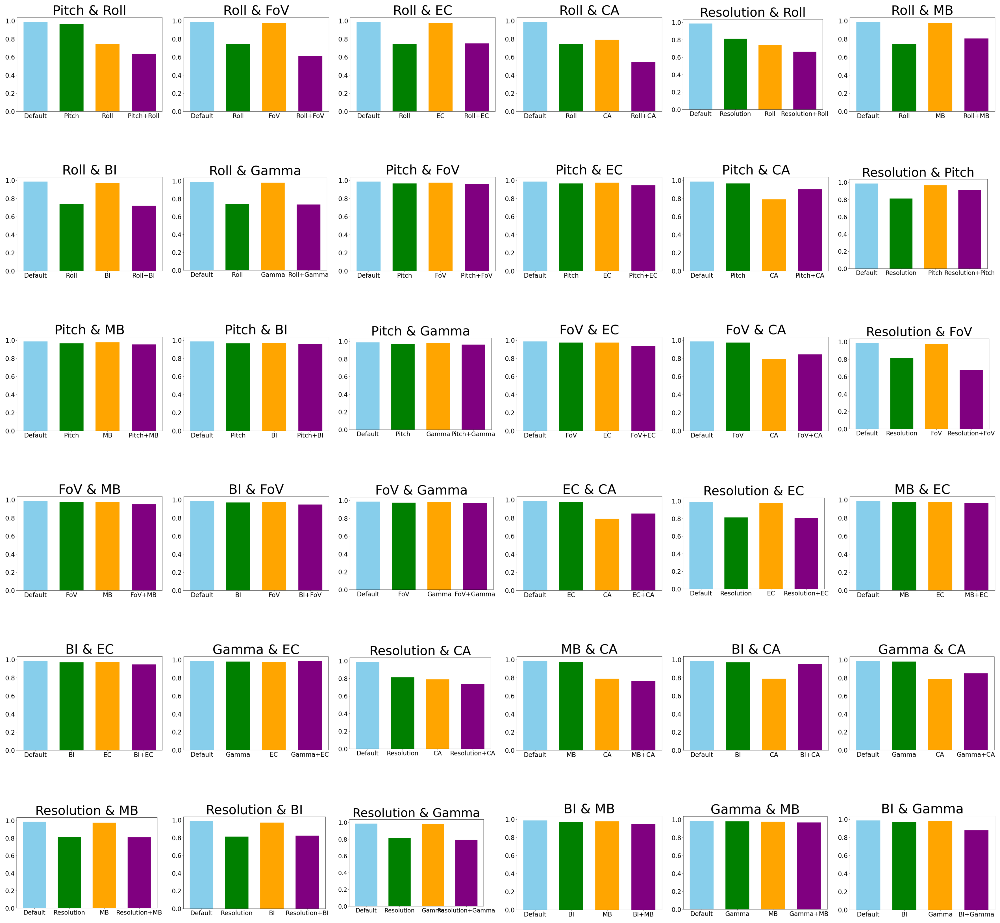

* SILog
 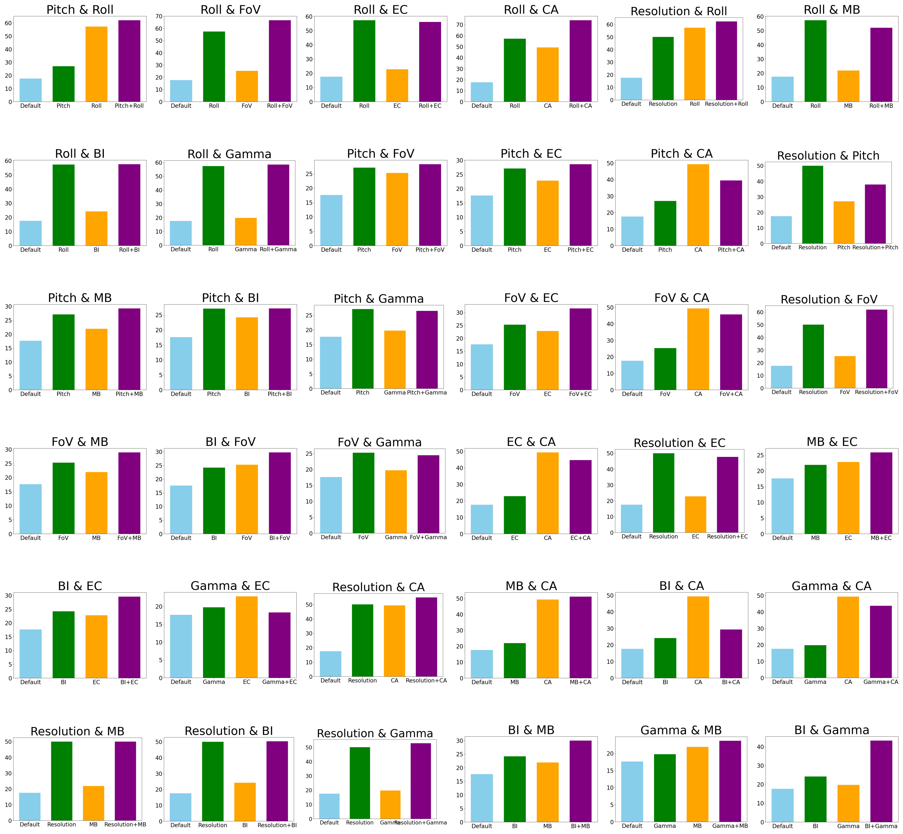
